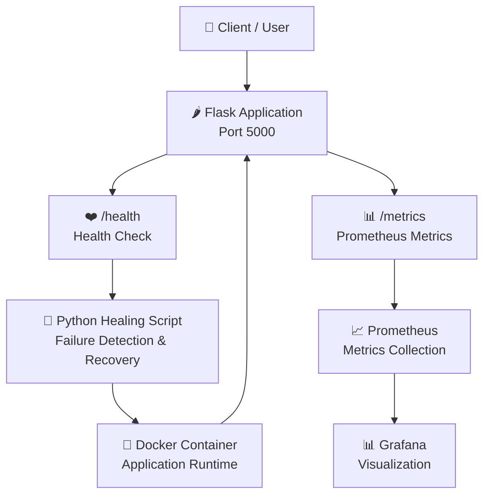
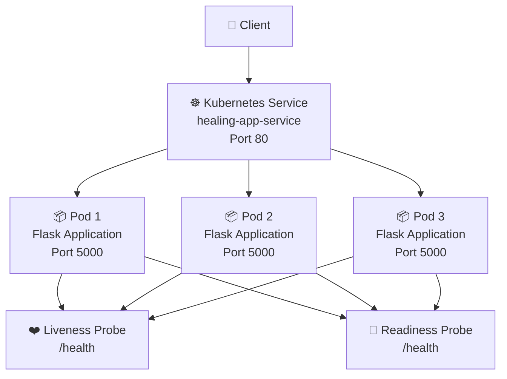
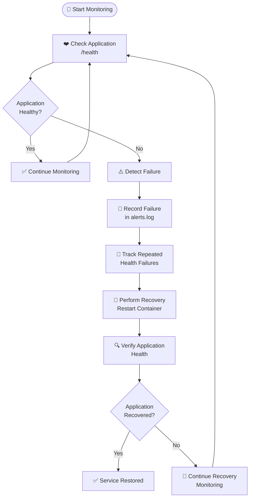
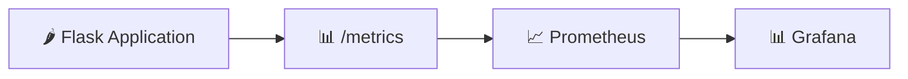
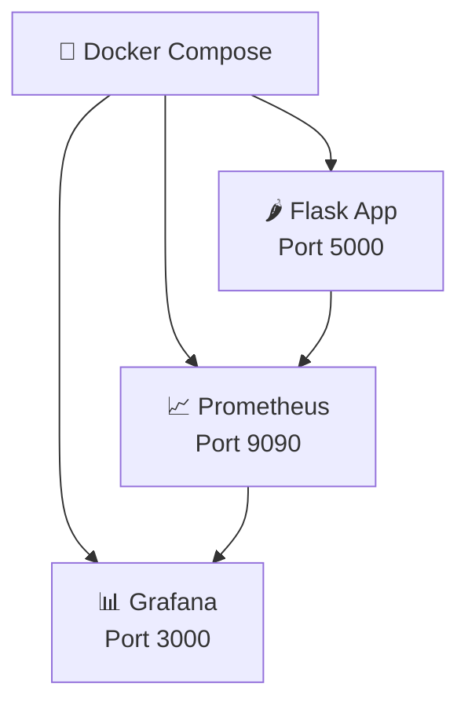
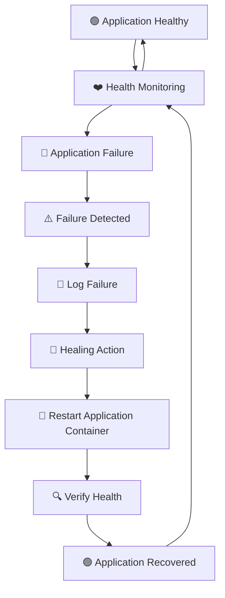
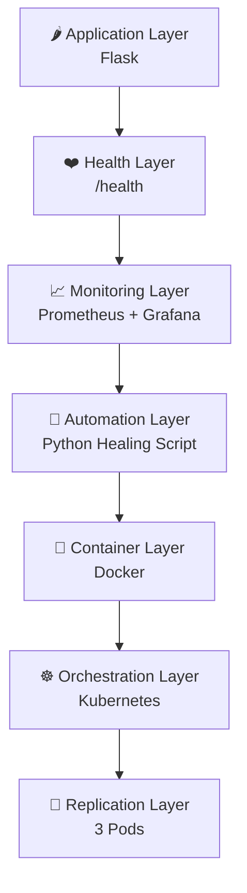
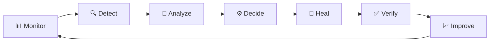

# ☁️ CloudHeal — Secure Self-Healing Cloud Infrastructure

<p align="center">


</p>

<p align="center">


</p>

<p align="center">
  <b>Detect • Monitor • Heal • Recover</b>
</p>

<p align="center">
  A lightweight cloud-native project demonstrating automated failure detection,
  monitoring, recovery, containerization, and Kubernetes-based resilience.
</p>

---

## 📌 Table of Contents

- [Overview](#-overview)
- [Problem Statement](#-problem-statement)
- [Project Objective](#-project-objective)
- [Key Features](#-key-features)
- [Architecture](#️-architecture)
- [Kubernetes Architecture](#️-kubernetes-architecture)
- [Self-Healing Workflow](#-self-healing-workflow)
- [Monitoring & Observability](#-monitoring--observability)
- [Docker Architecture](#-docker-architecture)
- [Project Structure](#-project-structure)
- [Technology Stack](#️-technology-stack)
- [Application Endpoints](#-application-endpoints)
- [Prerequisites](#-prerequisites)
- [Installation](#-installation)
- [Run with Docker Compose](#-run-with-docker-compose)
- [Run the Self-Healing Automation](#-run-the-self-healing-automation)
- [Kubernetes Deployment](#️-kubernetes-deployment)
- [Testing](#-testing)
- [Failure Recovery](#-failure-recovery)
- [Learning Outcomes](#-learning-outcomes)
- [Future Enhancements](#-future-enhancements)
- [Contributing](#-contributing)
- [Project Team](#-project-team)
- [License](#-license)

---

# 🚀 Overview

**CloudHeal** is a Secure Self-Healing Cloud Infrastructure project designed to demonstrate how modern cloud-native applications can detect failures, monitor system health, and initiate automated recovery actions.

The project combines:

- 🐍 Python
- 🌶️ Flask
- 🐳 Docker
- ☸️ Kubernetes
- 📊 Prometheus
- 📈 Grafana
- 🔄 Python-based healing automation

The main concept is simple:

> **When an application becomes unhealthy, the infrastructure should be able to detect the problem and take corrective action automatically.**

Instead of depending completely on manual intervention, CloudHeal demonstrates an automated workflow:

```text
Application
     ↓
Health Check
     ↓
Failure Detection
     ↓
Healing Automation
     ↓
Recovery Action
     ↓
Service Recovery
```

---

# 🎯 Problem Statement

In traditional application environments, service failures often require manual intervention.

A typical failure scenario may look like:

```text
Application Failure
       ↓
User Reports Problem
       ↓
Administrator Checks Server
       ↓
Administrator Identifies Failure
       ↓
Administrator Restarts Service
       ↓
Administrator Verifies Recovery
```

This process can increase:

- ⏱️ Recovery time
- 👨‍💻 Operational effort
- ⚠️ Service downtime
- 🔧 Manual dependency

CloudHeal demonstrates how monitoring and automation can be combined to create a more resilient infrastructure workflow.

---

# 🎯 Project Objective

The primary objective of this project is to demonstrate a simplified **self-healing cloud infrastructure**.

The project focuses on:

1. Application health monitoring
2. Automated failure detection
3. Containerized application deployment
4. Metrics collection
5. Infrastructure monitoring
6. Automated recovery
7. Kubernetes-based resilience
8. Application replication
9. Liveness and readiness monitoring

---

# ✨ Key Features

| Feature | Description |
|---|---|
| 🐍 Flask Application | Lightweight Python web application |
| ❤️ Health Endpoint | Provides application health information |
| 📊 Metrics Endpoint | Exposes Prometheus-compatible metrics |
| 🐳 Docker | Containerizes the Flask application |
| 🔄 Self-Healing | Detects failures and performs recovery actions |
| 📝 Alert Logging | Records healing-related events |
| 📈 Prometheus | Collects application metrics |
| 📊 Grafana | Provides monitoring visualization |
| ☸️ Kubernetes | Orchestrates application containers |
| 🔁 3 Replicas | Runs three application instances |
| 🩺 Liveness Probe | Detects unhealthy containers |
| 🚦 Readiness Probe | Determines whether containers can receive traffic |
| 🌐 Kubernetes Service | Exposes the application through a service |

---

# 🏗️ Architecture

The overall CloudHeal architecture consists of the application layer, monitoring layer, automation layer, container layer, and orchestration layer.



### 🔍 Architecture Flow

```text
Client
   │
   ▼
Flask Application
   │
   ├──────────────► /health ──────────────► Healing Script
   │                                            │
   │                                            ▼
   │                                      Recovery Action
   │                                            │
   │                                            ▼
   │                                       Docker
   │
   └──────────────► /metrics ─────────────► Prometheus
                                              │
                                              ▼
                                           Grafana
```

---

# ☸️ Kubernetes Architecture

CloudHeal also provides a Kubernetes deployment designed to improve application resilience through replication and health probes.

The deployment is configured with **3 application replicas**.



### Kubernetes Components

| Component | Configuration |
|---|---|
| Deployment | `healing-app` |
| Replicas | `3` |
| Application Port | `5000` |
| Service | `healing-app-service` |
| Service Port | `80` |
| Target Port | `5000` |
| Liveness Probe | `/health` |
| Readiness Probe | `/health` |
| Service Type | `LoadBalancer` |

---

# 🔄 Self-Healing Workflow

The self-healing mechanism is implemented in:

```text
automation/healing_script.py
```

The script continuously checks the health of the application and reacts when failures are detected.



### Self-Healing Process

```text
1. Application runs normally
          ↓
2. Monitoring script checks /health
          ↓
3. Health status becomes unhealthy
          ↓
4. Failure is detected
          ↓
5. Failure information is logged
          ↓
6. Repeated failures are tracked
          ↓
7. Recovery action is performed
          ↓
8. Container/service is restarted
          ↓
9. Application health is checked again
          ↓
10. Service returns to healthy state
```

---

# 📊 Monitoring & Observability

CloudHeal uses **Prometheus** and **Grafana** to provide application monitoring and visualization.

## 📈 Prometheus

Prometheus collects metrics exposed by the Flask application.

Configuration:

```text
monitoring/prometheus.yml
```

Metrics endpoint:

```text
/metrics
```

Monitoring flow:



---

## 📊 Grafana

Grafana acts as the visualization layer for monitoring data.

```text
Flask Application
       │
       ▼
   /metrics
       │
       ▼
  Prometheus
       │
       ▼
    Grafana
       │
       ▼
Visualization & Monitoring
```

Grafana can be used to visualize application and infrastructure-related metrics collected by Prometheus.

---

# 🐳 Docker Architecture

Docker is used to package the Flask application into a container.

The project also provides a Docker Compose configuration for running the application and monitoring services together.



### Docker Compose Services

| Service | Port | Purpose |
|---|---:|---|
| Flask Application | `5000` | Main web application |
| Prometheus | `9090` | Metrics collection |
| Grafana | `3000` | Monitoring visualization |

---

# 📁 Project Structure

```text
cloud-healing-project/
│
├── 📂 app/
│   ├── app.py
│   ├── Dockerfile
│   └── requirements.txt
│
├── 📂 automation/
│   ├── healing_script.py
│   └── alerts.log
│
├── 📂 monitoring/
│   └── prometheus.yml
│
├── ☸️ deployment.yaml
├── ☸️ service.yaml
│
├── 🐳 docker-compose.yml
│
├── 🌐 index.html
├── ☁️ aws.html
├── 🐳 docker.html
├── 🧪 flask.html
├── 📊 grafana.html
├── ☸️ kubernetes.html
├── 📈 prometheus.html
├── 🐍 python.html
├── 🔗 compose.html
│
├── 🎨 tech-shared.css
├── ⚙️ install.cmd
│
├── 📊 CloudHeal_Presentation.pptx
├── 📖 README.md
└── 📜 LICENSE
```

---

# 🧩 Core Components

## 🌶️ Flask Application

Location:

```text
app/app.py
```

The Flask application provides the main service functionality.

### Main Endpoints

```text
/
 /health
 /metrics
```

The `/health` endpoint is used by the monitoring and Kubernetes health-check mechanisms.

The `/metrics` endpoint exposes metrics for Prometheus.

---

# ❤️ Health Monitoring

The `/health` endpoint provides a simple way to determine whether the application is operational.

Example:

```text
GET /health
```

Expected response:

```json
{
  "status": "healthy"
}
```

This endpoint is used by:

- Self-healing automation
- Kubernetes liveness probes
- Kubernetes readiness probes

---

# 📊 Metrics

The application exposes:

```text
/metrics
```

Prometheus can scrape this endpoint and collect application metrics.

The monitoring architecture is:

```text
Flask
  │
  ▼
/metrics
  │
  ▼
Prometheus
  │
  ▼
Grafana
```

---

# 🔄 Healing Automation

Location:

```text
automation/healing_script.py
```

The healing script is responsible for monitoring application health and initiating recovery actions when configured failure conditions occur.

The script also uses:

```text
automation/alerts.log
```

for recording healing-related events.

---

# ☸️ Kubernetes Deployment

Kubernetes configuration:

```text
deployment.yaml
```

The deployment provides:

- 3 replicas
- Application container
- Port 5000
- Liveness probe
- Readiness probe

The health probes use:

```text
/health
```

---

# 🌐 Kubernetes Service

Configuration:

```text
service.yaml
```

The Kubernetes service is:

```text
healing-app-service
```

It exposes:

```text
Port: 80
Target Port: 5000
Type: LoadBalancer
```

Traffic flow:

```text
Client
   │
   ▼
Kubernetes Service :80
   │
   ├──► Pod 1 :5000
   ├──► Pod 2 :5000
   └──► Pod 3 :5000
```

---

# 🛠️ Technology Stack

| Technology | Purpose |
|---|---|
| 🐍 Python | Application and automation |
| 🌶️ Flask | Web application framework |
| 🐳 Docker | Containerization |
| 🐳 Docker Compose | Multi-container environment |
| ☸️ Kubernetes | Container orchestration |
| 📈 Prometheus | Metrics collection |
| 📊 Grafana | Monitoring visualization |
| 📝 YAML | Infrastructure configuration |
| 🌐 HTML | Web interface |
| 🎨 CSS | Styling |

---

# 📦 Python Dependencies

The application's dependencies are defined in:

```text
app/requirements.txt
```

The project uses packages including:

```text
Flask
prometheus_client
requests
```

---

# 🌐 Application Endpoints

| Endpoint | Purpose |
|---|---|
| `/` | Main application endpoint |
| `/health` | Health check |
| `/metrics` | Prometheus metrics |

---

# ⚙️ Prerequisites

Before running CloudHeal, make sure the following are installed.

### Required

- Python 3.x
- Docker
- Docker Compose

### For Kubernetes

- Kubernetes cluster
- `kubectl`

You can use environments such as:

- Minikube
- Docker Desktop Kubernetes
- Kind
- Cloud Kubernetes platforms

---

# 🚀 Installation

## 1️⃣ Clone the Repository

```bash
git clone https://github.com/gla-cloud-healing/cloud-healing-project.git
```

---

## 2️⃣ Enter the Project Directory

```bash
cd cloud-healing-project
```

---

# 🐳 Run with Docker Compose

Build and start the complete environment:

```bash
docker compose up --build
```

This starts the application and monitoring services.

Expected services:

```text
Flask Application → 5000
Prometheus        → 9090
Grafana           → 3000
```

---

# 🌐 Access the Services

### 🌶️ Flask Application

```text
http://localhost:5000
```

### ❤️ Health Check

```text
http://localhost:5000/health
```

### 📊 Metrics

```text
http://localhost:5000/metrics
```

### 📈 Prometheus

```text
http://localhost:9090
```

### 📊 Grafana

```text
http://localhost:3000
```

---

# 🛑 Stop Docker Compose

To stop the complete environment:

```bash
docker compose down
```

---

# 🔄 Run the Self-Healing Automation

From the project root:

```bash
python automation/healing_script.py
```

The script monitors the application health and performs the configured recovery action when failure conditions are detected.

---

# ☸️ Kubernetes Deployment

Make sure your Kubernetes cluster is running.

## 1️⃣ Apply Deployment

```bash
kubectl apply -f deployment.yaml
```

## 2️⃣ Apply Service

```bash
kubectl apply -f service.yaml
```

---

# 🔍 Check Kubernetes Resources

### Check Deployment

```bash
kubectl get deployments
```

### Check Pods

```bash
kubectl get pods
```

### Check Services

```bash
kubectl get services
```

### Detailed Pod Information

```bash
kubectl describe pods
```

---

# ❤️ Verify Kubernetes Health

The Kubernetes deployment uses:

```text
Liveness Probe
      ↓
/health
```

and:

```text
Readiness Probe
      ↓
/health
```

Check pod status:

```bash
kubectl get pods
```

A healthy pod should eventually show:

```text
READY   STATUS
1/1     Running
```

---

# 🧪 Testing

CloudHeal can be tested layer by layer.

## Application Test

Open:

```text
http://localhost:5000
```

---

## Health Test

Open:

```text
http://localhost:5000/health
```

Expected:

```json
{
  "status": "healthy"
}
```

---

## Metrics Test

Open:

```text
http://localhost:5000/metrics
```

Prometheus-compatible metrics should be available.

---

## Docker Test

Run:

```bash
docker ps
```

Verify that the required containers are running.

---

## Kubernetes Test

Run:

```bash
kubectl get pods
```

Verify that the application replicas are running.

---

# 🔥 Failure Recovery

The fundamental CloudHeal concept is:



---

# 🧠 Traditional vs Self-Healing Approach

| Traditional Approach | CloudHeal Approach |
|---|---|
| Failure occurs | Failure occurs |
| Manual detection | Automated health check |
| Manual investigation | Automated monitoring |
| Manual restart | Automated recovery action |
| Manual verification | Automated health verification |

The project demonstrates the transition from:

```text
Manual Operations
       ↓
Monitoring
       ↓
Automation
       ↓
Self-Healing Infrastructure
```

---

# 🛡️ Resilience Layers

CloudHeal demonstrates multiple resilience mechanisms.



---

# 🎓 Learning Outcomes

This project provides practical exposure to several cloud and DevOps concepts.

## ☁️ Cloud Computing

- Cloud resilience
- Fault tolerance
- Service availability
- Automated recovery
- Infrastructure monitoring

## 🐳 Docker

- Dockerfiles
- Docker images
- Docker containers
- Docker Compose
- Containerized applications

## ☸️ Kubernetes

- Pods
- Deployments
- Replicas
- Services
- Liveness probes
- Readiness probes
- Application orchestration

## 📊 Monitoring

- Prometheus
- Grafana
- Application metrics
- Health checks
- Observability

## 🔄 Automation

- Automated monitoring
- Failure detection
- Recovery actions
- Alert logging

---

# 🔮 Future Enhancements

The current project provides a foundation that can be extended with additional cloud-native capabilities.

Possible future enhancements include:

- 🚨 Advanced alerting
- 📧 Email notifications
- 💬 Slack/Teams notifications
- ☁️ AWS deployment
- 📊 Custom Grafana dashboards
- 🔍 Advanced anomaly detection
- 📝 Centralized logging
- 🔐 Secrets management
- ⚙️ Infrastructure as Code
- 🔄 Automated rollback
- 📦 Kubernetes ConfigMaps
- 🔐 Kubernetes Secrets
- 📈 Horizontal Pod Autoscaling
- 🧪 Chaos engineering
- 🔗 CI/CD pipeline integration
- 🛡️ Container security scanning

---

# 🌟 Future Vision

The long-term vision of CloudHeal is to evolve from a demonstration project into a more advanced automated cloud resilience platform.



This creates a continuous resilience loop:

> **Monitor → Detect → Analyze → Heal → Verify → Improve**

---

# 📚 Project Resources

The repository also contains supporting educational pages covering technologies used in the project.

### Technology Pages

- Python
- Flask
- Docker
- Docker Compose
- Kubernetes
- Prometheus
- Grafana
- AWS

The project also includes:

```text
CloudHeal_Presentation.pptx
```

which can be used for project demonstrations and presentations.

---

# 🤝 Contributing

Contributions are welcome.

## Contribution Workflow

### 1. Fork the repository

Create your own fork of the project.

### 2. Clone your fork

```bash
git clone https://github.com/YOUR_USERNAME/cloud-healing-project.git
```

### 3. Create a feature branch

```bash
git checkout -b feature/your-feature
```

### 4. Make your changes

Implement and test your changes.

### 5. Stage the changes

```bash
git add .
```

### 6. Commit

```bash
git commit -m "Add: your feature"
```

### 7. Push

```bash
git push origin feature/your-feature
```

### 8. Create a Pull Request

Open a Pull Request to the main repository.

---

# 🧹 Development Guidelines

When contributing to CloudHeal:

- Keep changes focused
- Follow the existing project structure
- Use meaningful variable and file names
- Document important functionality
- Test Docker changes before committing
- Validate Kubernetes YAML files
- Keep monitoring configuration readable
- Use meaningful commit messages
- Avoid committing sensitive credentials

---

# ⚠️ Project Scope

CloudHeal is currently a **demonstration and learning project** focused on the concepts of cloud monitoring, automation, resilience, and self-healing infrastructure.

It demonstrates the following workflow:

```text
Monitoring
    ↓
Failure Detection
    ↓
Automated Recovery
    ↓
Health Verification
    ↓
Service Restoration
```

Additional security, reliability, scalability, observability, and operational controls would be required before using a system of this type as a production infrastructure platform.

---

# 📊 Project Highlights

```text
                    ☁️ CLOUDHEAL
                         │
                         ▼
                  🌶️ Flask App
                         │
             ┌───────────┴───────────┐
             ▼                       ▼
        ❤️ /health               📊 /metrics
             │                       │
             ▼                       ▼
      🔄 Healing Script         📈 Prometheus
             │                       │
             ▼                       ▼
       🐳 Docker                  📊 Grafana
             │
             ▼
       ☸️ Kubernetes
             │
       ┌─────┼─────┐
       ▼     ▼     ▼
      Pod   Pod   Pod
       1     2     3
             │
             ▼
      🛡️ Resilient
    Infrastructure
```

---

# 👥 Project Team

## Cloud Healing Project

**Secure Self-Healing Cloud Infrastructure**

Built with:

```text
Python
Flask
Docker
Kubernetes
Prometheus
Grafana
Automation
```

### Core Focus

> **Automation • Monitoring • Resilience • Self-Healing**

---

# 📜 License

Please refer to the repository's existing `LICENSE` file for the applicable licensing terms.

---

# ⭐ Support the Project

If you find CloudHeal useful:

⭐ Star the repository

🍴 Fork the repository

🐛 Report issues

💡 Suggest improvements

🔧 Contribute enhancements

---

<p align="center">

## ☁️ CloudHeal

### Detect • Monitor • Heal • Recover

</p>

<p align="center">

Built with ❤️ using Python • Flask • Docker • Kubernetes • Prometheus • Grafana

</p>
